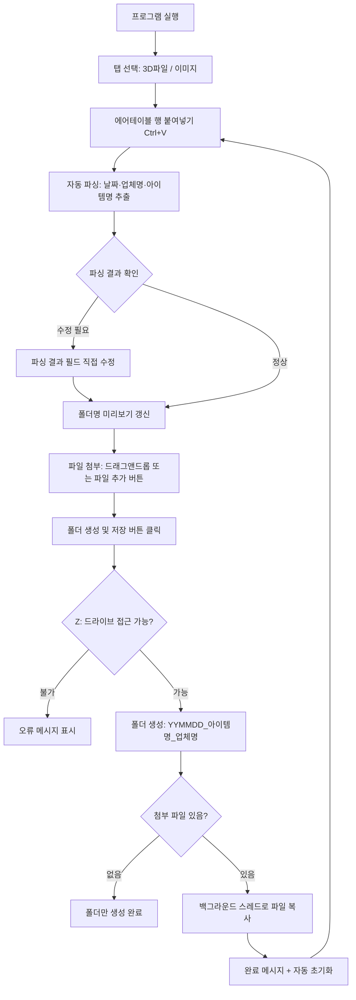

작성일: 2026-04-01
작성자: PROCPA (Claude Opus 4.6 보조)

# 2. 기능 명세서

## 2.1. 작동 순서 흐름도

## 2.2. 기능 목록

### F-01. 탭 전환
| 항목 | 내용 |
|---|---|
| 기능명 | 탭 전환 (3D파일 / 이미지) |
| 설명 | 상단 탭바에서 파일 유형별 작업 공간 전환 |
| 트리거 | 탭 버튼 클릭 |
| 동작 | QStackedWidget로 탭 콘텐츠 교체. 각 탭은 독립적인 상태(파싱 결과, 파일 목록) 유지 |
| 차이점 | 3D탭은 `TARGET_3D` 경로, 이미지탭은 `get_image_target()` 경로 사용 |

### F-02. 에어테이블 행 붙여넣기 및 자동 파싱
| 항목 | 내용 |
|---|---|
| 기능명 | 자동 파싱 |
| 설명 | 에어테이블에서 복사한 탭 구분 텍스트를 붙여넣으면 자동으로 날짜·업체명·아이템명 추출 |
| 트리거 | Ctrl+V (붙여넣기) 또는 텍스트 입력 |
| 입력 | 탭(`\t`)으로 구분된 에어테이블 행 텍스트 |
| 파싱 규칙 | 아래 컬럼 매핑 참조 |
| 출력 | 파싱 결과 필드 자동 채움 + 폴더명 미리보기 |
| 예외 처리 | 컬럼 수 부족 시 상태바에 안내 메시지 |

**컬럼 매핑 (0-based index):**

| 인덱스 | 필드명 | 변환 규칙 |
|---|---|---|
| 1 | 날짜 (`COL_DATE`) | `YYYY-MM-DD HH:MM` → `YYMMDD` 형식으로 변환. 파싱 실패 시 오늘 날짜 사용 |
| 5 | 업체명 (`COL_COMPANY`) | 그대로 사용. 첨부파일 링크 포함 시 `(http...` 이전 텍스트만 추출 |
| 8 | 아이템명 (`COL_PRODUCT`) | 그대로 사용. 동일한 링크 정리 규칙 적용 |

### F-03. 파싱 결과 수정
| 항목 | 내용 |
|---|---|
| 기능명 | 파싱 결과 직접 수정 |
| 설명 | 자동 파싱된 날짜·업체명·아이템명을 사용자가 직접 편집 가능 |
| 트리거 | 파싱 결과 필드 클릭 후 타이핑 |
| 동작 | 수정 즉시 폴더명 미리보기 갱신 |

### F-04. 초기화
| 항목 | 내용 |
|---|---|
| 기능명 | 전체 초기화 |
| 설명 | 붙여넣기 영역, 파싱 결과, 파일 목록 전부 초기화 |
| 트리거 | 초기화 버튼 클릭 |
| 동작 | 모든 입력값 클리어, 드롭 영역 복원, 상태 초기화 |

### F-05. 파일 첨부 (드래그앤드롭)
| 항목 | 내용 |
|---|---|
| 기능명 | 파일 드래그앤드롭 |
| 설명 | 탐색기에서 파일을 드래그하여 드롭 영역에 놓으면 파일 목록에 추가 |
| 트리거 | 파일을 드롭 영역에 드래그 |
| 동작 | URL에서 로컬 파일 경로 추출, 중복 파일 무시, 파일 목록 갱신 |
| 표시 정보 | 확장자 뱃지(색상 구분) + 파일명 + 파일 크기 |

### F-06. 파일 첨부 (파일 선택 다이얼로그)
| 항목 | 내용 |
|---|---|
| 기능명 | 파일 추가 버튼 |
| 설명 | 시스템 파일 선택 대화상자를 통한 파일 추가 |
| 트리거 | `+ 파일 추가` 버튼 클릭 또는 드롭 영역 클릭 |
| 초기 경로 | 바탕화면 (`~/Desktop`) |
| 동작 | 다중 파일 선택 가능, 중복 파일 무시 |

### F-07. 파일 삭제
| 항목 | 내용 |
|---|---|
| 기능명 | 파일 삭제 |
| 설명 | 첨부 파일 목록에서 개별 또는 전체 삭제 |
| 방법 1 | 파일 항목의 `×` 버튼 → 해당 파일 삭제 |
| 방법 2 | `선택 삭제` 버튼 → 선택된 파일 삭제 |
| 방법 3 | `전체 삭제` 버튼 → 전체 파일 목록 초기화 |

### F-08. 폴더 생성 및 파일 저장
| 항목 | 내용 |
|---|---|
| 기능명 | 폴더 생성 및 저장 |
| 설명 | 파싱된 정보를 기반으로 네트워크 드라이브에 폴더 생성 후 파일 복사 |
| 트리거 | CTA 버튼 클릭 |
| 사전 검증 | ① 날짜·업체명·아이템명 모두 입력 확인 ② Z: 드라이브 접근 가능 확인 |
| 폴더 생성 | `{base_path}/{YYMMDD}_{아이템명}_{업체명}/` 형식으로 생성 |
| 파일 복사 | `shutil.copy2()`로 메타데이터 포함 복사. QThread로 백그라운드 실행 |
| 진행 표시 | 상태바에 `파일 복사 중... (N/M)` 표시 |
| 완료 후 | 결과 팝업 표시 → 자동 초기화 (다음 건 즉시 처리 가능) |

### F-09. 상태 표시
| 항목 | 내용 |
|---|---|
| 기능명 | 하단 상태바 |
| 설명 | 현재 작업 상태를 실시간 표시 |
| 상태 인디케이터 | ● 회색: 대기, ● 초록: 작업 중/완료 |
| 표시 내용 | 파싱 결과, 파일 추가/삭제, 복사 진행률, 완료/오류 |
