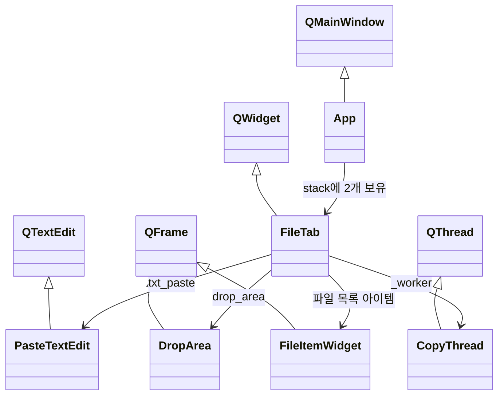

작성일: 2026-04-01
작성자: PROCPA (Claude Opus 4.6 보조)

# 5. 모듈 상세 설계

## 5.1. app.py — 메인 GUI 프로그램

### 5.1.1. 클래스 구조

### 5.1.2. PasteTextEdit

| 항목 | 내용 |
|---|---|
| 상속 | `QTextEdit` |
| 역할 | Ctrl+V 시 기존 텍스트 자동 클리어 후 새 텍스트 삽입 |
| 오버라이드 | `insertFromMimeData(source)` — clear() 후 setPlainText() |

### 5.1.3. CopyThread

| 항목 | 내용 |
|---|---|
| 상속 | `QThread` |
| 역할 | 파일 복사를 백그라운드에서 수행하여 UI 멈춤 방지 |
| 입력 | `files` (복사할 파일 Path 리스트), `dest` (대상 폴더 Path) |
| 시그널 | `progress(int, int)` — 현재/전체 진행률, `done(object, list, list)` — 완료 시 결과 |
| 복사 방식 | `shutil.copy2()` — 메타데이터 보존 복사 |

### 5.1.4. FileItemWidget

| 항목 | 내용 |
|---|---|
| 상속 | `QFrame` |
| 역할 | 파일 리스트의 개별 행 위젯 |
| 시그널 | `removed(object)` — 삭제 시 해당 파일의 Path 전달 |
| 구성 요소 | 확장자 뱃지 + 파일명 + 파일 크기 + × 삭제 버튼 |
| 뱃지 색상 | 3D 파일(STL, OBJ 등)은 초록, 나머지는 파랑 |

### 5.1.5. DropArea

| 항목 | 내용 |
|---|---|
| 상속 | `QFrame` |
| 역할 | 파일 드래그앤드롭 수신 영역 |
| 시그널 | `files_dropped(list)` — 드롭된 파일 Path 리스트, `clicked()` — 클릭 시 |
| 이벤트 | `dragEnterEvent` — URL 있으면 수락, `dropEvent` — 파일 경로 추출, `mousePressEvent` — 클릭 시그널 |

### 5.1.6. FileTab

| 항목 | 내용 |
|---|---|
| 상속 | `QWidget` |
| 역할 | 3D / 이미지 공통 탭 UI 및 로직 |
| 생성자 인수 | `target_base` (저장 경로), `btn_label` (CTA 버튼 텍스트) |
| 시그널 | `status_changed(str, str)` — 상태 메시지 + 타입 |

**주요 메서드:**

| 메서드 | 역할 |
|---|---|
| `_do_parse()` | 텍스트 영역 내용을 탭 구분 파싱 |
| `_on_field_edit()` | 파싱 결과 필드 수정 시 미리보기 갱신 |
| `_on_files_dropped(paths)` | 드래그앤드롭 파일 추가 |
| `_add_files()` | 파일 선택 다이얼로그로 파일 추가 |
| `_remove_file(filepath)` | 특정 파일 삭제 |
| `_refresh_files()` | 파일 리스트 UI 갱신 (드롭 영역 ↔ 리스트 전환) |
| `_create_folder()` | 폴더 생성 + 파일 복사 실행 |
| `_copy_done(dest, copied, errors)` | 복사 완료 후 결과 표시 + 초기화 |
| `_reset()` | 전체 상태 초기화 |

### 5.1.7. App

| 항목 | 내용 |
|---|---|
| 상속 | `QMainWindow` |
| 역할 | 메인 윈도우, 탭 전환, 상태바 관리 |
| 창 크기 | 440 × 740 (고정) |
| 구조 | 탭 헤더(QFrame) + QStackedWidget(FileTab ×2) + 상태바(QFrame) |

## 5.2. utils.py — 공통 유틸리티

### 5.2.1. 상수

| 상수 | 값 | 설명 |
|---|---|---|
| `TARGET_3D` | `Z:\2 제품개발팀\【1】 3D 의뢰파일` | 3D 파일 저장 경로 |
| `TARGET_IMAGE_BASE` | `Z:\1 공통 운영\...\01. 의뢰·제작 제품` | 이미지 저장 기본 경로 |
| `TARGET_BASE` | `TARGET_3D`와 동일 | 하위 호환용 별칭 |
| `EXT_ICONS` | dict | 확장자 → 이모지 아이콘 매핑 |

### 5.2.2. 함수

| 함수 | 인수 | 반환 | 설명 |
|---|---|---|---|
| `check_drive(base)` | `base: Path` (기본: TARGET_3D) | `bool` | 대상 경로 접근 가능 여부 확인 |
| `get_image_target()` | 없음 | `Path` | 현재 연도 기준 이미지 저장 경로 반환 (`.../{YYYY}년`) |
| `make_folder(product, company, date, base)` | 아이템명, 업체명, 날짜, 기본 경로 | `Path` | `{date}_{product}_{company}` 폴더 생성 후 경로 반환 |

## 5.3. save_from_paste.py — CLI 파서 (레거시)

Claude 에이전트용 CLI 도구. GUI 프로그램과 동일한 파싱 로직을 커맨드라인에서 실행.

| 모드 | 명령 | 설명 |
|---|---|---|
| 대화형 | `python save_from_paste.py` | 텍스트 직접 입력 |
| 인자 전달 | `python save_from_paste.py --paste "텍스트"` | Claude 에이전트에서 호출 |
| 컬럼 탐지 | `python save_from_paste.py --detect` | 컬럼 구조 확인용 |
